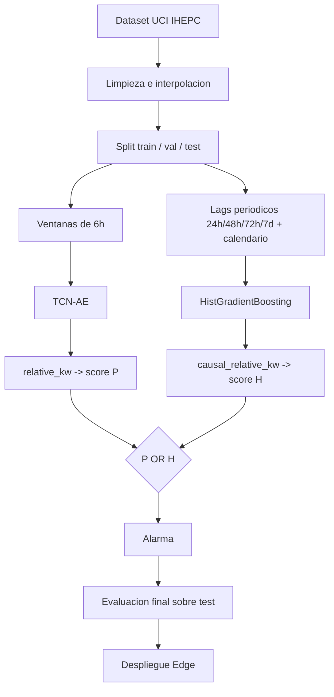

# Detección no supervisada de fraude eléctrico residencial (FDIA)

## Objetivo del proyecto

Detectar infrarreporte de consumo eléctrico (fraude por manipulación de datos, FDIA) en un
contador residencial individual, sin usar en ningún momento etiquetas de fraude real: el modelo
se entrena solo con consumo limpio y aprende a reconocer cuándo una lectura deja de parecerse a
lo que ese hogar consume habitualmente. Dataset: UCI "Individual Household Electric Power
Consumption" (id=235), variable `Global_active_power` a resolución de 1 minuto.

El enfoque final combina dos detectores de naturaleza distinta (uno reconstructivo, uno
predictivo) en vez de apostar por uno solo, y el resultado se lleva hasta un despliegue Edge
real: un microservicio HTTP con estado por contador que procesa lecturas una a una, pensado para
ejecutarse en un dispositivo con recursos limitados, no en un entorno de entrenamiento.

## Arquitectura final: P OR H

La arquitectura congelada, y la única que cuenta como resultado final del proyecto, es
`OR_PMULTI_HMULTIWINDOW`: se dispara alarma si **P** o **H** disparan alarma, cada uno con su
propio umbral calibrado por separado.

- **P** parte de un **TCN-AE** (`src/models/tcn_ae.py`), un autoencoder convolucional temporal
  que reconstruye ventanas de 6h de consumo limpio. El score es `relative_kw`: cuanto peor
  reconstruye una ventana nueva, más sospechosa es. Variante final: `P_MULTI_SEASON`, con el
  umbral recalibrado por estación en vez de fijo.
- **H** es un predictor causal (`src/predictor_causal_lags.py`) — un
  `HistGradientBoostingRegressor` que predice el consumo a 15 min a partir de lags periódicos
  (24h, 48h, 72h y 7 días antes) más calendario, sin usar consumo reciente. El score es
  `causal_relative_kw`. Variante final: `H_MULTIWINDOW_180`, calibrada exigiendo robustez en 6
  bloques de 30 días en vez de una única ventana.
- La alarma final es el **OR** de ambos: `active_P_MULTI_SEASON OR active_H_MULTIWINDOW_180`.
  Usar dos detectores compensa que cada uno falla en casos distintos (ver Resultados).


## Pipeline resumido



Train se queda con consumo limpio; los ataques (`src/attacks.py` y afines) se inyectan solo
sobre val/test para evaluar, nunca para entrenar.

## Estructura del repositorio

```
configs/           parámetros del pipeline offline (un único base.yaml)
src/               pipeline offline: carga, split, P, H, fusión, calibración, evaluación final
experiments/       experimentos aislados fuera del pipeline principal (piloto de replay)
models/            checkpoints y artefactos congelados (P, H, OR)
manifests/         episodios de ataque de test, congelados con hash
results/tables/    tablas intermedias necesarias para reproducir decisiones ya tomadas
edge_deployment/   despliegue: motor online, API, Docker, seguridad, tests, benchmarks
```

`data/` y `results/figures/` no se versionan (se regeneran al ejecutar el pipeline); el dataset
se descarga solo la primera vez que se ejecuta `src/data_loading.py`.

## Archivos clave

| Archivo | Qué es |
|---|---|
| `configs/base.yaml` | Única fuente de parámetros del pipeline offline (ventanas, arquitectura del TCN-AE, umbrales de partida). |
| `src/data_loading.py` | Carga el dataset UCI y rellena los huecos por interpolación lineal. |
| `src/pipeline.py` | Orquesta carga + split + ventaneo + normalización + carga del modelo; lo reutiliza el resto del código. |
| `src/models/tcn_ae.py` | Arquitectura y entrenamiento del TCN-AE (P). |
| `src/base_relative.py` | Declara `relative_kw` como score base de P y fija el checkpoint de 360 min. |
| `src/attacks.py` | Las 5 funciones de ataque puras: reducción constante, variable, bypass total, bypass residual, recorte de picos. |
| `src/predictor_causal_lags.py` | Nace H: compara Ridge/HistGB con y sin lags recientes; gana `HistGB_PERIODIC`. |
| `src/fusion_p_histgb.py` | Primera fusión OR de P y H. |
| `src/robustez_temporal_p.py` | Nace `P_MULTI_SEASON` (el umbral fijo de P se saturaba en consumo atípico). |
| `src/calibracion_temporal_h.py` | Nace `H_MULTIWINDOW_180`. |
| `src/auditoria_final_p_vs_or.py` | Decisión final: P solo vs. fusión OR, con los 14 criterios ya fijados. |
| `src/congelacion_final_or_pretest.py` | Congela la arquitectura final en `models/final_or_pretest/`. |
| `src/evaluacion_final_retrospectiva_test.py` | Única ejecución sobre la partición de test. |
| `edge_deployment/core/detector_engine.py` | Motor de inferencia online: mismo P/H/OR, pero lectura a lectura y con estado. |
| `edge_deployment/api/main.py` | API FastAPI que envuelve el motor. |
| `edge_deployment/security/anti_replay.py` | Capa opcional de autenticación anti-replay (HMAC + ventana temporal). |

## Cómo reproducir el resultado final

**1. Construcción y selección del detector** (entrena P y H, y decide la arquitectura final —
nunca toca test):

```bash
python -m src.data_loading
python -m src.splitting
python -m src.windowing
python -m src.normalization
python -m src.models.tcn_ae            # entrena o carga el checkpoint de P
python -m src.predictor_causal_lags    # nace H
python -m src.fusion_p_histgb          # primera fusion OR
python -m src.optimizacion_histgb_periodic   # optimiza H con validacion walk-forward
python -m src.robustez_temporal_p      # nace P_MULTI_SEASON
python -m src.calibracion_temporal_h   # nace H_MULTIWINDOW_180
python -m src.auditoria_final_p_vs_or  # decide P solo vs. fusion OR
```

**2. Congelación y evaluación final** (abre la partición de test, una sola vez):

```bash
python -m src.congelacion_final_or_pretest
python -m src.evaluacion_final_retrospectiva_test
```

**3. Edge** — ver la sección de despliegue más abajo.

## Artefactos finales

Los artefactos vigentes de la arquitectura congelada son:

- **Checkpoint de P**: `models/tcn_ae_ventana360.pt` (TCN-AE, ventana 360 min).
- **Modelo y calibración de H, y configuración conjunta**: `models/final_or_pretest/`
  (`histgb_periodic_final.joblib`, `profile_train_final.joblib`, `threshold_p_final.json`
  = 0.049748, `threshold_h_final.json` ≈ 0.8836, `configuracion_final_or_pretest.json`, con
  hashes SHA-256 de cada fichero en `hashes_finales.json`).
- **Manifiesto de ataques de test**: `manifests/test_attacks_v2/attack_manifest_test_v2.csv`
  (1680 episodios sobre 140 segmentos base). La v1 (`manifests/test_attacks/`) queda preservada
  intacta como registro histórico, pero está superada por v2.
- **Edge** no versiona artefactos propios: `edge_deployment/core/` lee directamente los dos
  artefactos anteriores. Solo genera uno propio (`edge_deployment/models/params_norm_p.joblib`,
  la normalización de P sin depender del CSV crudo) mediante un script de congelación manual de
  un solo uso, `python -m edge_deployment.core.freeze_params_norm`, más un manifiesto de
  integridad (`python -m edge_deployment.core.manifest_v2 --build`) que valida esos hashes en
  cada arranque de la API.

## Ataques evaluados

- **Reducciones y bypass** (`src/attacks.py`): reducción constante, reducción variable, bypass
  total (consumo a 0) y bypass residual (deja un residuo).
- **Rampas** (`src/experimento_ramp.py`): la reducción crece linealmente en el tiempo en vez de
  aplicarse de golpe.
- **Replay** (`experiments/replay_pilot/`): en vez de transformar la ventana actual, se sustituye
  por una ventana donante real de otro momento de la serie (mismo día 24h antes, o mismo día de
  la semana anterior). No encaja como transformación pura (`y = h(x)`) porque necesita una
  segunda ventana y su propio manifiesto, así que se trata como un piloto aparte. Es también el
  único ataque que se aborda además con una medida no basada en el modelo: la capa anti-replay de
  Edge (ver más abajo).

## Resultados principales

| | P | H | OR |
|---|---|---|---|
| DR energético (% de energía oculta detectada) | 59.8% | 69.8% | **73.3%** |
| Falsas alarmas | 0.017/día | 0.061/día | 0.078/día |

*Tabla calculada solo sobre las 5 familias del manifiesto final: reducción constante/variable,
bypass total/residual y rampa. Replay quedó fuera de estos 1680 episodios ya que al ver que su detección por contenido era
prácticamente nula, y se trasladó al despliegue Edge como problema de autenticación en vez de
seguir ajustando el modelo (ver más abajo).*

- La fusión mejora el DR energético sobre cualquiera de los dos detectores por separado, y
  conserva el 99.2% de lo que detectaba P solo y el 100% de lo que detectaba H solo: son
  complementarios, no redundantes.
- Clasificación final: `CONFIRMATORY_SUPPORT`, admisible operativamente (sin saturación, FA
  dentro de presupuesto).
- El replay es prácticamente indetectable por contenido: DR inducido de solo 1.7% en el piloto
  dedicado de 60 episodios. Es la única familia de ataque donde el modelo no aporta casi nada,
  y la razón por la que Edge añade autenticación en vez de seguir ajustando el detector.

## Despliegue Edge

`edge_deployment/` reimplementa la misma arquitectura P OR H para inferencia online, lectura a
lectura, con estado por contador (`meter_id`):

- **Motor** (`core/`): agregación causal a 15 min, ventanas de P, lags de H, fusión OR — todo
  sobre buffers acotados en memoria, nunca releyendo el histórico completo.
- **API** (`api/`, FastAPI): `/health`, `/ready`, `/bootstrap` (carga contexto histórico),
  `/readings` (procesa una lectura), `/status/{meter_id}`, `/metrics`, `/reset/{meter_id}`.
- **Docker** (`Dockerfile`, `Dockerfile.baseline`): dos imágenes — una de referencia y otra
  optimizada (usuario no-root, sin caché de pip, healthcheck) — sin tocar el modelo ni la
  precisión numérica.
- **Procesamiento de lecturas**: valida cada lectura (duplicados, fuera de orden, huecos) antes
  de tocar ningún buffer; un hueco descarta el bucket parcial en curso, nunca se rellena con
  ceros ni se interpola.
- **Benchmarks** (`benchmarks/`, `docker_tools/`): latencia y memoria en local, vía TestClient y
  vía Uvicorn real, y dentro de contenedor con límites de CPU/memoria.
- **HMAC y anti-replay** (`security/`): capa paralela y opcional sobre `POST /secure-readings`,
  desactivada por defecto. Activable con `FDIA_ANTI_REPLAY_ENABLED=true`; añade autenticación
  HMAC-SHA-256 por contador, número de secuencia y ventana de frescura de timestamp, sin
  modificar `/readings`.

## Experimentos adicionales

El resto de `src/` (stride, tamaño de ventana, agregación del score, análisis de
detectabilidad, CUSUM, Energy Distance, modelos alternativos de H, etc.) son experimentos que
justifican decisiones de diseño concretas — por qué esa ventana, por qué ese score, por qué se
descartó tal alternativa — pero no forman parte de la arquitectura final `P OR H`.
